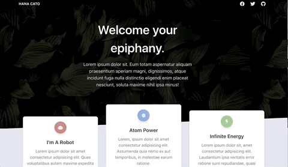

# Animated Template
This project is playing with the AOS animation library, and studying the implications it has on performance. Like how animation at the top section of the page makes the website appear to take longer to load. It's all about perspective.

Mostly all of the HTML/CSS (except very small modifications) is the Landing Page from [Tailwind Starter Kit](https://www.creative-tim.com/learning-lab/tailwind-starter-kit/presentation) and the animation library is [AOS](https://michalsnik.github.io/aos/). 

[Github Page to the project](https://hanabeth.github.io/animated-template/)

## Resources Used
[Tailwind Starter Kit - Template](https://www.creative-tim.com/learning-lab/tailwind-starter-kit/presentation)

[Font Awesome - Social Media Icons](https://fontawesome.com/icons?d=gallery&q=moon&m=free)

[Unsplash API - Images Used](https://unsplash.com/documentation)

[RandomUser.me - User Images Used](https://randomuser.me/)

[AOS - Animation Libary](https://michalsnik.github.io/aos/)

## Finally
Meditate and be well.
